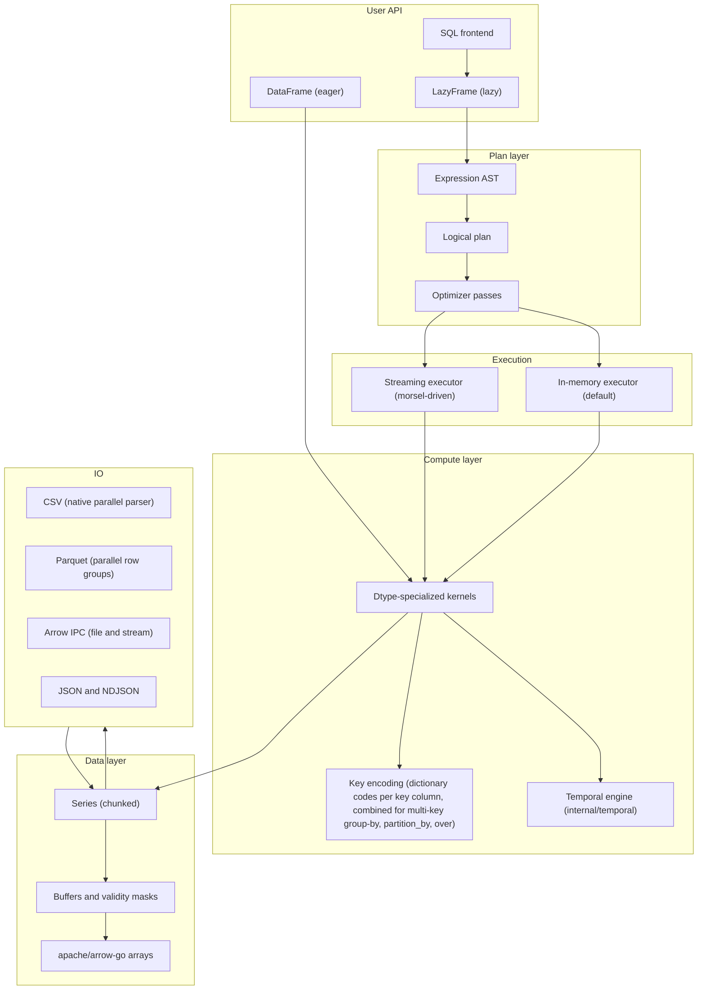
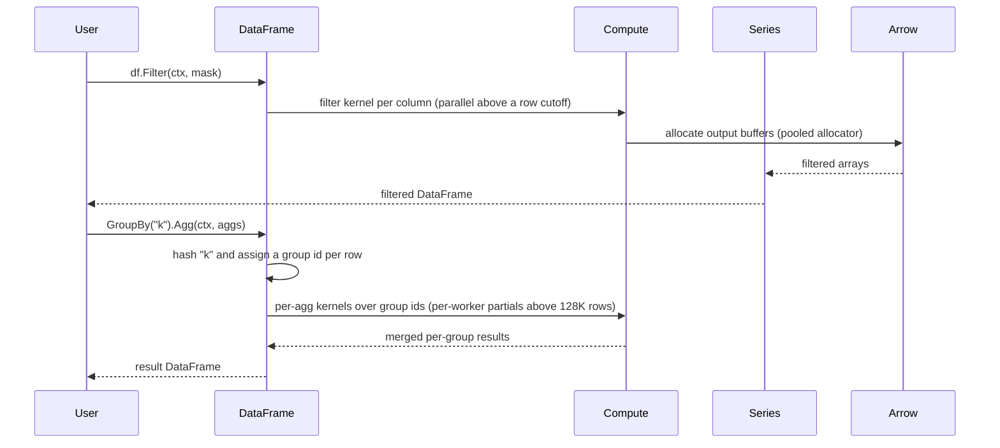
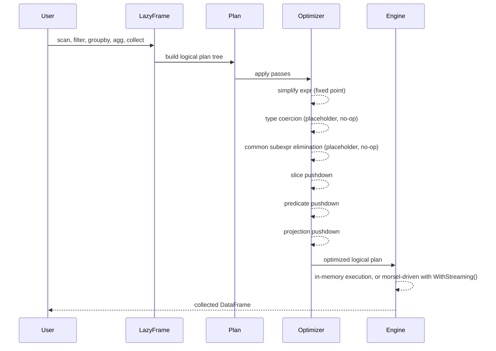

# Architecture overview

golars is a layered query engine over Apache Arrow memory. The user writes code against the `DataFrame` (eager) or `LazyFrame` (lazy) facades. Lazy code flows through an expression AST, a logical plan and an optimizer; the executor then runs the optimized logical plan directly (there is no separate physical plan). Both eager and lazy paths converge on the same compute kernels and Series primitives.

## Layered component map

## Boundary between golars and arrow-go

golars uses `apache/arrow-go/v18` as its memory and IO substrate. The line is:

**arrow-go owns:**
- Array implementations (`arrow.Array`, all typed arrays)
- Memory allocation, buffers, reference counts (`memory.Allocator`, `memory.Buffer`)
- Arrow IPC reader and writer
- Parquet encoding and decoding (`pqarrow`); golars decodes row groups in parallel on top of it
- CSV writing, plus the fallback CSV reader for the few options the native parser does not handle
- Schema primitives at the physical level (`arrow.Schema`, `arrow.Field`)

**golars owns:**
- A logical dtype model on top of arrow dtypes (`dtype.DType`), with polars-style names and semantics (for example dates, datetimes with a time unit and optional time zone, lists, fixed-size arrays, structs, categoricals and enums backed by arrow dictionary arrays, and the `Null` dtype).
- `Series` as a named, chunked, nullable column with dtype-aware methods
- `DataFrame` composition and transformation operations
- Expression AST (`expr`), expression evaluator (`eval`), logical plan and optimizer (`lazy`)
- Streaming executor (`stream`)
- Group-by, join, sort, and pivot algorithms
- SQL frontend (`sql`), which compiles a query into a `LazyFrame` plan
- The CSV reader (`io/csv`): the input is split into record-aligned chunks that are tokenized and parsed concurrently straight into arrow buffers, with polars-style type inference
- Temporal semantics (`internal/temporal`): calendar arithmetic, polars duration strings (`"1mo"`, `"2h30m"`), time zones through `time.LoadLocation`, strftime and strptime, window bounds for `group_by_dynamic` and `rolling`, and business days. It works on raw int64 physical values so `series`, `compute` and `dataframe` share one implementation.
- Display: `internal/reprtable` turns a frame or series into a display-ready table that backs `HTML` and `MimeBundle` on frames and series (text, HTML, and a JSON table for terminal notebooks)

When a polars feature exists in arrow-go with the right semantics, we wrap rather than reimplement. When polars' semantics differ from arrow's (null handling edge cases, dtype promotion, string comparisons), we implement in golars and document the choice.

## Data flow in an eager pipeline

## Data flow in a lazy pipeline

The streaming executor is opt-in (`lf.Collect(ctx, lazy.WithStreaming())`). It reads morsels (DataFrames of bounded row count, 64K rows by default) from a source, pipes them through operator goroutines over buffered channels, and terminates at a sink. Each parallel stage fans out to `min(GOMAXPROCS, 8)` workers and preserves input order. Sort, Aggregate and Join are pipeline breakers and run eagerly on the materialized prefix. See [parallelism.md](parallelism.md).

## Conformance strategy

We use py-polars as the behavioral oracle during development. Behavioral parity lives in `*_parity_test.go` files next to the code they cover (for example `compute/filter_parity_test.go`, `series/valuecounts_parity_test.go`). Each ports scenarios from polars' own test suite and hard-codes the values polars produces, so a drift fails as an ordinary Go test. The `internal/testutil` package supplies the shared helpers, chiefly `NewCheckedAllocator`, which fails a test that leaks an Arrow buffer.

This keeps us honest about semantics without pulling Python into CI. Python (via `uv` in `bench/polars-compare/`) is only needed to check new polars behavior or to run the performance comparison.
