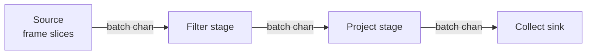

# Parallelism model

Go's concurrency primitives fit analytical query execution well. Goroutines are cheap, channels provide back-pressure for free, and `select` handles cancellation cleanly. This document describes how golars uses them.

## Two kinds of parallelism

golars distinguishes two parallelism patterns:

1. **Data parallelism inside a single operator.** A wide projection evaluates each column expression on its own worker; a large filter splits rows across workers. Results keep input order. This is what the eager executor uses.
2. **Pipeline parallelism across operators.** A filter+project chain over a large frame runs the scan, the filter stages and the project stages as separate stages, each in its own goroutines, communicating via channels. This is what the streaming executor uses.

Both patterns compose. A single stage in the streaming executor may itself run data-parallel kernels internally.

## Concurrency primitives

`internal/pool` offers `ParallelFor` (index-range fan-out), `MapChunks` (one output slot per input, order-preserving) and `Group` (a context-aware errgroup wrapper with a parallelism bound), all cancellation-aware. Hot kernels also use `sync.WaitGroup` directly where the pattern is a fixed fan-out with no early exit.

There is no process-wide worker pool: goroutines are spawned per call. Spawning costs ~1µs per `ParallelFor` invocation, so every parallel kernel has a row-count cutoff below which it runs serially (see below). Worker counts are capped at `min(GOMAXPROCS, 8)` so small shared runners are not oversubscribed.

## Cutoffs (tuned by benchmark, frozen unless a bench run says otherwise)

- Arithmetic, filter, take, sort: serial below a per-kernel row cutoff, parallel above. Representative values: filter parallelises above 256K rows (`compute/filter_parallel_cutoff_*.go`), take above 64K, horizontal reductions above 128K rows with 4 workers up to 256K rows and 8 above.
- Group-by hash paths (single and multi-key) fan out at 128K rows (`hashAggParThreshold`); the multi-key path additionally samples the first partition and stays serial for high-cardinality inputs where every worker would rediscover every group.
- Cast to float64 uses SIMD kernels below 128K rows, parallel workers up to 1M rows, streaming stores above.
- Rolling, top-k heaps and small sorts stay serial; lazily evaluated wide projections (`Select` with 8+ expressions) and wide filters (8+ columns) fan out across columns instead.

## Morsel-driven streaming

The streaming executor borrows the morsel-driven model from HyPer and DuckDB and adapts it to Go. The implementation lives in the `stream` package; `lazy.WithStreaming()` compiles streaming-friendly plan prefixes into a `stream.Pipeline`.

Primitives currently available:

- `Source`, `Stage`, `Sink` as plain function types.
- `DataFrameSource` slices an in-memory frame into morsels of at most `MorselRows` (default 64K).
- `FilterStage`, `ProjectStage`, `WithColumnsStage`, `RenameStage`, `DropStage`, `SliceStage`.
- `ParallelMapStage` is the combinator that turns a per-morsel function into an order-preserving fan-out. It tags morsels on ingress with a sequence number, dispatches to a small worker pool, and uses a reorder buffer on egress so downstream stages see input order regardless of worker count. `ParallelFilterStage`, `ParallelProjectStage`, `ParallelWithColumnsStage` are thin wrappers. Parallel stages are the default (`min(GOMAXPROCS, 8)` workers, `WithStreamingWorkers(1)` forces serial).
- `CollectSink` concatenates morsel chunks column-wise into a single DataFrame. A single morsel skips the pipeline entirely and evaluates eagerly.

Hybrid execution: `lazy.Collect(ctx, lazy.WithStreaming())` runs the longest streaming-friendly prefix through the pipeline executor. When a blocker node (Sort, Aggregate, Join) appears above that prefix, the upstream DataFrame is materialized first and the blocker runs eagerly. This keeps the surface simple (one `Collect` call) while letting streaming pay off for scan + filter + project chains and not regress for blockers.

**Morsel.** A morsel is a small `DataFrame` (`stream.Morsel`) with a bounded row count. All inter-stage communication is in morsels.

**Channel back-pressure.** Every inter-stage channel has a small buffer (default 4). When a downstream stage is slow, its input channel fills, blocking the producer. This is the back-pressure mechanism, and it costs no allocation.

**Pipeline breakers.** Sort and groupby-agg with no suitable partition key are pipeline breakers. They buffer, compute, and then emit. The streaming executor tracks breakers explicitly so planners can decide when spilling is necessary.

**Cancellation.** Every stage takes a `context.Context`. When the context cancels (user abort, downstream error, sink closed), stages drain their input channels, release references to any morsels they hold, and return.

## Why goroutines over thread pools

polars uses Rayon, which is ideal for CPU-bound data-parallel loops in Rust. Go's goroutine scheduler does the same job for our workloads with less ceremony:

- Goroutine spawn costs on the order of a microsecond, so kernels gate parallelism behind row-count cutoffs and share nothing between calls.
- Channels are zero-allocation queues (for values up to channel element size). We do not reinvent bounded queues.
- `select` handles timeouts, cancellation, and multi-source reads in one construct. No event loop needed.

The tradeoff is that Go does not give us work-stealing the way Rayon does. In practice this matters less than it seems because our work units (morsels, row partitions) are large enough that simple static partitioning is rarely the bottleneck. If profiling proves otherwise, we introduce work-stealing without changing the operator interface.

## Determinism

Parallel execution must not change results. Rules:

- Chunked operations preserve chunk order in the output. A parallel filter produces chunks in the same order as input, even if they finished out of order.
- Reductions merge partials in worker order, so results are reproducible for a fixed `GOMAXPROCS`. Floating-point parallel sums may differ in the last ulp across worker counts (non-associativity); integer sum/min/max/count are exact.
- Sort is stable. Multi-key group-by emits groups in sorted-key order (single-key uses first-seen order); `over()` broadcasts preserve input row order.
- Row order in a DataFrame is preserved across operations unless an operation explicitly reorders (sort, join, groupby).

The race detector runs over the hot packages in CI; parity tests pin behavioural agreement with polars.

## Scheduling heuristics

- Row-count cutoffs per kernel (see above); below the cutoff, serial wins.
- Multi-key groupby samples the first partition: average group size above ~32 rows goes parallel, below stays serial.
- Streaming morsel size defaults to 64K rows (`WithStreamingMorselRows` tunes it); worker count defaults to `min(GOMAXPROCS, 8)`.
- `GOMAXPROCS` caps every fan-out so constrained environments are not oversubscribed.
